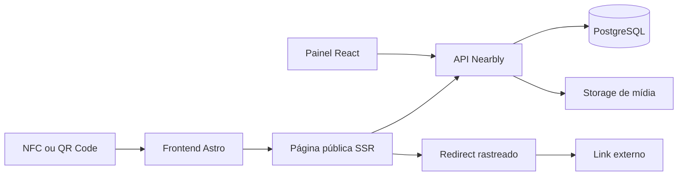

<div align="center">
  
  <h1>Nearbly</h1>
  <p><strong>O seu negócio mais perto.</strong></p>
  <p>
    Uma experiência digital para negócios locais: um toque NFC ou uma leitura de QR Code abre uma página pública com links, conteúdo e métricas úteis.
  </p>
  <p>
    <a href="docs/API.md">Contrato da API</a> ·
    <a href="Nearbly.Frontend/README.md">Frontend</a> ·
    <a href="AGENTS.md">Guia de engenharia</a>
  </p>
</div>


> **Status:** MVP em evolução. O produto já cobre páginas públicas, painel administrativo, tracking de acessos e analytics agregados.

## Visão geral

Nearbly transforma um identificador físico em uma entrada digital simples para uma loja ou negócio local:

1. A pessoa aproxima o celular de um identificador NFC ou aponta a câmera para um QR Code.
2. A página pública do negócio é carregada com identidade visual, abas e conteúdo ativo.
3. Cada link passa por um redirect rastreado, sem expor a URL externa na página pública.
4. A administração acompanha visualizações, cliques e origem dos acessos.

O projeto foi desenhado para manter a experiência pública rápida e indexável, sem sacrificar um painel administrativo completo para gerenciar o conteúdo.

## O que já existe

- Páginas institucionais prerenderizadas com Astro.
- Páginas públicas de lojas renderizadas no servidor.
- Painel administrativo com autenticação JWT.
- CRUD de lojas, abas e links com desativação lógica.
- Conteúdo tipado por aba: links, produtos, Markdown e galeria.
- Upload e processamento de imagens para WebP, com suporte a filesystem e storage S3 compatível.
- Redirect rastreado para cliques em links.
- Analytics agregados por período e origem: NFC, QR Code, acesso direto e desconhecido.
- API documentada com OpenAPI/Swagger e respostas de erro em Problem Details.
- Testes unitários de domínio, testes de frontend e testes de integração com PostgreSQL via Testcontainers.

## Arquitetura



O backend é um monólito modular em .NET 10. Os projetos possuem responsabilidades explícitas e seguem estas dependências:

```text
Application -> Domain
Infrastructure -> Application + Domain
Api -> Application + Infrastructure
```

| Parte | Responsabilidade |
| --- | --- |
| `Nearbly.Domain` | Entidades, enums, validadores e regras puras do domínio. |
| `Nearbly.Application` | Casos de uso, DTOs, contratos e validações. |
| `Nearbly.Infrastructure` | EF Core, PostgreSQL, Identity, JWT e armazenamento de mídia. |
| `Nearbly.Api` | Composição da aplicação, Minimal APIs e middleware HTTP. |
| `Nearbly.Frontend` | Site institucional, páginas públicas SSR e painel React. |

## Stack

| Camada | Tecnologias |
| --- | --- |
| Backend | .NET 10, ASP.NET Core Minimal APIs, EF Core 10, FluentValidation |
| Dados | PostgreSQL 17, migrations EF Core, Testcontainers |
| Autenticação | ASP.NET Core Identity e JWT Bearer |
| Frontend | Astro 7, React 19, TypeScript, Vite |
| UI e interação | React Query, React Hook Form, Zod, DnD Kit, Recharts, Lucide |
| Mídia | ImageSharp, filesystem local ou S3 compatível |
| Operação local | Docker Compose, Yarn |

## Pré-requisitos

- .NET SDK `10.0.302` ou uma versão compatível com o arquivo [`global.json`](global.json).
- Node.js `>=22.12.0`.
- Yarn Classic `1.x`, habilitado pelo Corepack.
- Docker Desktop ou Docker Engine com Docker Compose.

O PostgreSQL local é iniciado pelo Compose. A API roda diretamente com o SDK .NET durante o desenvolvimento, enquanto o frontend roda com o Astro em modo server.

## Começando localmente

### 1. Configurar o ambiente

Na raiz do projeto:

```bash
cp .env.example .env
set -a
source .env
set +a
```

O arquivo `.env` é ignorado pelo Git. Os valores do exemplo são apenas para desenvolvimento local e devem ser substituídos antes de qualquer uso compartilhado ou publicação.

### 2. Subir o banco e preparar a API

```bash
docker compose up -d postgres
dotnet tool restore
dotnet restore Nearbly.Backend/Nearbly.sln
dotnet ef database update \
  --project Nearbly.Backend/src/Nearbly.Infrastructure \
  --startup-project Nearbly.Backend/src/Nearbly.Api
dotnet run --project Nearbly.Backend/src/Nearbly.Api
```

Endpoints locais:

- API: `http://localhost:5112`
- Swagger: `http://localhost:5112/swagger`

O login bootstrap é criado somente quando `BootstrapAdmin__Email` e `BootstrapAdmin__Password` estão configurados e ainda não existe um usuário com aquele e-mail. A senha não é redefinida automaticamente.

### 3. Rodar o frontend

Em outro terminal:

```bash
cd Nearbly.Frontend
cp .env.example .env
yarn install --frozen-lockfile
yarn dev
```

O frontend fica disponível em `http://localhost:4321`.

Rotas principais:

| Rota | Comportamento |
| --- | --- |
| `/` | Página institucional principal. |
| `/solucoes` | Visão das soluções Nearbly. |
| `/como-funciona` | Fluxo de acesso e métricas. |
| `/:slug` | Página pública SSR de uma loja. |
| `/admin/login` | Login administrativo. |
| `/admin/lojas/**` | Painel de lojas, conteúdo e analytics. |

### Alternativa: executar tudo com Docker

Com o `.env` criado na raiz:

```bash
docker compose up --build
```

Esse comando inicia PostgreSQL e API em `http://localhost:5112`. O frontend continua sendo executado separadamente com `yarn dev`.

## Configuração

As variáveis mais importantes são:

| Variável | Uso |
| --- | --- |
| `ConnectionStrings__Default` | Connection string do PostgreSQL. |
| `Jwt__SigningKey` | Chave privada usada para assinar JWT; use pelo menos 32 bytes e um valor exclusivo por ambiente. |
| `BootstrapAdmin__Email` | E-mail do administrador inicial. |
| `BootstrapAdmin__Password` | Senha do administrador inicial. |
| `Cors__AllowedOrigins__0` | Origem permitida para chamadas do frontend. |
| `Media__Provider` | `filesystem` para desenvolvimento ou `s3` para storage compatível. |
| `Media__S3__*` | Endpoint, bucket e credenciais quando o provider S3 estiver ativo. |
| `API_BASE_URL` | URL da API usada pelo servidor Astro. |
| `PUBLIC_API_BASE_URL` | URL da API usada no navegador; nunca coloque segredos em variáveis `PUBLIC_*`. |

Consulte [`.env.example`](.env.example) e [`Nearbly.Frontend/.env.example`](Nearbly.Frontend/.env.example) para a lista completa.

## API

O contrato HTTP versionado está em [`docs/API.md`](docs/API.md). Os endpoints principais são:

```text
POST /api/admin/auth/login
GET|POST|PUT|DELETE /api/admin/stores
GET|POST|PUT|DELETE /api/admin/stores/{storeId}/tabs
GET|POST|PUT|DELETE /api/admin/stores/{storeId}/links
GET /api/admin/stores/{storeId}/analytics
GET /api/public/stores/{slug}
POST /api/public/stores/{slug}/views
GET /r/{linkId}?src=nfc|qr_code|direct|unknown
```

Todos os endpoints administrativos, exceto login, exigem `Authorization: Bearer <accessToken>`. Endpoints públicos não expõem a URL externa dos links: a página aponta sempre para `/r/{linkId}`.

## Testes e qualidade

Backend:

```bash
dotnet build Nearbly.Backend/Nearbly.sln
dotnet test Nearbly.Backend/Nearbly.sln
```

Frontend:

```bash
cd Nearbly.Frontend
yarn build
yarn lint
yarn test
```

Os testes de integração do backend precisam de Docker disponível para iniciar o PostgreSQL de teste. Alterações de endpoint, DTO, status, enum ou regra de compatibilidade devem atualizar [`docs/API.md`](docs/API.md) e os testes correspondentes.

## Segurança e publicação

Os arquivos de configuração versionados usam placeholders; `.env`, builds, dependências instaladas e dados locais estão ignorados pelo Git. Ainda assim, valide o histórico e os segredos do ambiente antes de cada publicação.

Antes de publicar ou fazer deploy:

- Nunca versione `.env`, senhas, tokens, chaves JWT ou credenciais S3.
- Gere um `Jwt__SigningKey` diferente para cada ambiente e com pelo menos 32 bytes.
- Troque a senha do administrador bootstrap antes de disponibilizar a API.
- Não exponha PostgreSQL diretamente à internet.
- Publique a API atrás de HTTPS e configure `Cors__AllowedOrigins` apenas com origens conhecidas.
- Mantenha Swagger desabilitado fora de ambientes controlados, salvo quando houver uma necessidade explícita.
- Não registre tokens, senhas, IPs, User-Agents ou URLs individuais de analytics.

O repositório pode ser público do ponto de vista de segredos depois destes cuidados. Ele ainda contém `AGENTS.md` e `MEMORIES.md`, que são documentos de engenharia e decisões internas; eles não contêm credenciais, mas podem ser removidos da distribuição pública se a intenção for expor apenas documentação de produto e código.

## Contribuindo

1. Crie uma branch a partir de `main`.
2. Mantenha as fronteiras entre Domain, Application, Infrastructure e API.
3. Prefira as abstrações e padrões já usados no projeto.
4. Atualize testes e documentação de API junto com alterações de contrato.
5. Rode os checks locais antes de abrir um pull request.

## Licença

Este repositório ainda não possui um arquivo `LICENSE`. Tornar o código visível publicamente não concede automaticamente permissão de uso, cópia ou redistribuição. Antes de apresentar o projeto como open source, escolha e adicione uma licença adequada.
